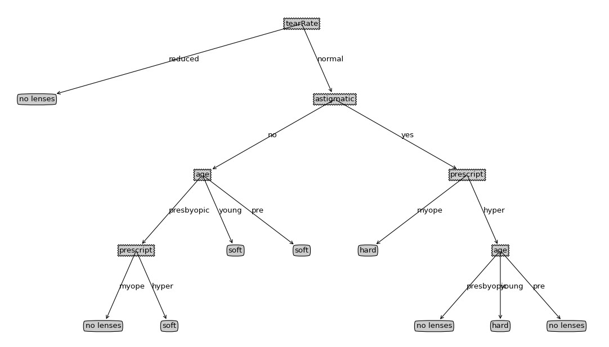

DecisionTree
============

##The implementation of the ID3 Decision Tree algorithm. 

###The code is written by Python Language.There are mainly two files:

1.trees.py:   including the training and testing of Decision tree.

2.treePlotter.py:   mainly used to draw the decision tree.

The plot of the generated decision tree:

